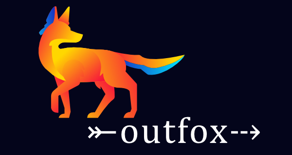

## ... a repository of clever little ⤜libraries⤏

Everything we make is released under libre, free open source licenses. Most of the code is written in C#.

## ... reducing ⤜complexity⤏ in game dev!
We're a rag-tag, non-profit assemblage of passionate contributors crafting a couple of small, unique game development libraries that do things creatively, quickly, and without weighing you and your codebase down.

## ... come ⤜contribute⤏ to fun technology!
Demos, ideas, libraries - do you want to make something documented and coded to a high standard of quality and playfulness? We're always down for friendly collaboration - [hit us up on Discord!](https://discord.gg/3SF4gWhANS)